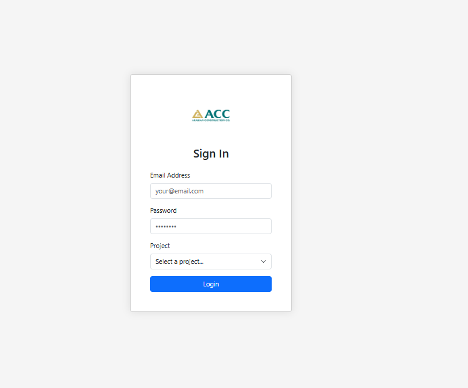
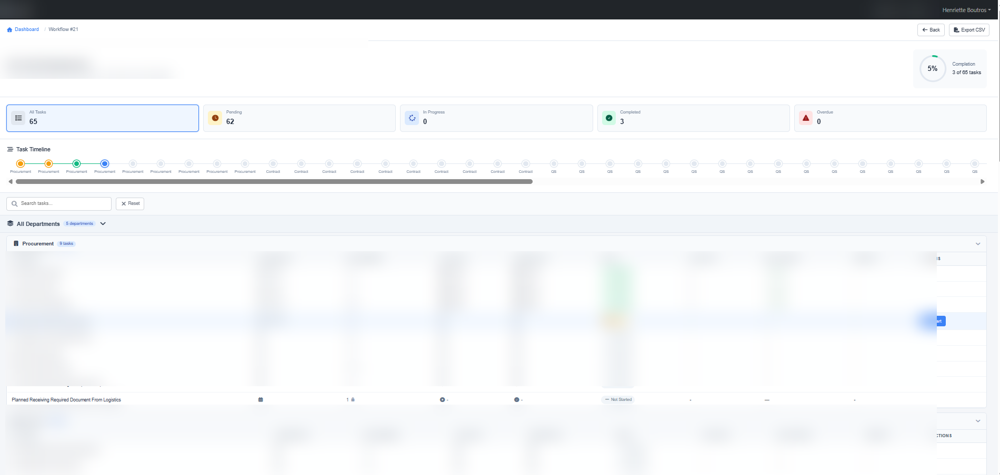
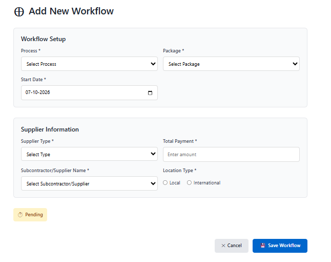

# ACCKpi-portfolio
Workflow &amp; Task Management System built with Next.js 

<div align="center">

# 📊 Workflow & KPI Management System

### Enterprise Workflow Automation & KPI Tracking Platform

**A full-stack business workflow platform for managing multi-department processes, tasks, deadlines, approvals, delays, notifications, and KPIs in one centralized system.**


[Features](#-key-features) · [Architecture](#️-architecture) · [Migration](#-legacy-migration) · [Performance](#-performance-engineering) · [Getting Started](#-getting-started)

</div>

---

## 🎯 Project Overview

The **Workflow & KPI Management System** is an enterprise application designed to coordinate business processes across multiple departments.

Each workflow is broken into departments, tasks, owners, planned dates, and execution stages. The system automatically tracks progress, identifies delays, advances workflows, notifies the next responsible department, and provides management with KPI dashboards and reporting.

### 💼 My Role

**Full-Stack Developer · Software Architect**

I designed and developed the application while migrating an existing production workflow system from a legacy **Express.js + EJS monolith** to a modern **Next.js + React architecture**.

The migration transformed a single ~5,000-line server file into a modular application with:

* React-based user interfaces
* File-based routing
* RESTful API endpoints
* Encrypted authentication sessions
* Role-based authorization
* SQL Server optimization
* Automated workflow progression
* Department handoffs and email notifications
* KPI dashboards and reporting

> **Portfolio Note:** This repository represents a sanitized portfolio version of a production internal application. Company names, credentials, infrastructure information, and business-sensitive data have been removed.

---

## 📸 Screenshots

> Add project screenshots to `docs/screenshots/`.

|        Login & Authentication        |              Workflow Dashboard              |
| :----------------------------------: | :------------------------------------------: |
|  |  |

|            Task Management           |            new workFlow            |
| :----------------------------------: | :----------------------------------: |
|  |  |

---

# ✨ Key Features

## 🔐 Authentication & Authorization

* Encrypted HTTP-only cookie sessions using `iron-session`
* Authentication hooks for protected pages
* Role-based access control
* Department-level permissions
* Users can only perform actions allowed for their department
* Protected administrative functionality
* Secure parameterized SQL queries

---

## 🔄 Workflow Automation Engine

The core of the application is a configurable workflow engine that coordinates processes across multiple departments.

### Workflow lifecycle

```text
Project
   ↓
Workflow
   ↓
Department 1
   ↓
Task 1 → Task 2 → Task 3
   ↓
Department 2
   ↓
Task 4 → Task 5
   ↓
Department 3
   ↓
Completed
```

### Automated workflow behavior

* Workflows are created from reusable process templates
* Departments execute according to configurable step order
* Tasks execute sequentially within each department
* Completing a task automatically identifies the next task
* Planned dates are calculated automatically
* Completing a department triggers the next department
* Email notifications are sent during department handoffs
* Workflow history is maintained for auditing

---

## ⏱️ Task Lifecycle & Tracking

Each task follows a controlled lifecycle:

| Action      | System Behavior                                            |
| ----------- | ---------------------------------------------------------- |
| **Start**   | Records actual start time and initializes the planned date |
| **Finish**  | Records completion time and calculates delay               |
| **Update**  | Allows required days and delay information to be updated   |
| **History** | Maintains an audit trail of task changes                   |

The system distinguishes between:

* Pending
* In Progress
* Completed
* Overdue

This provides both operational teams and management with a clear view of workflow performance.

---

## 🔁 Multi-Stage Workflow Management

The platform supports workflows that repeat across multiple business stages.

For example:

```text
Stage 1
├── Department A
├── Department B
└── Department C

Stage 2
├── Department A
├── Department C
└── Department D
```

The workflow engine can:

* Create multiple stages
* Reset task state for each stage
* Skip departments that only participate once
* Preserve previous stage history
* Continue the workflow without losing historical data

---

## 📈 KPI Dashboards & Reporting

Management dashboards provide a high-level view of operational performance.

### Dashboard capabilities

* Overall workflow completion percentage
* Pending task statistics
* In-progress tasks
* Completed tasks
* Overdue tasks
* Department performance timelines
* Workflow-level KPIs
* Task-level details
* CSV data export

### Example KPI flow

```text
                    Workflow
                       │
          ┌────────────┼────────────┐
          ↓            ↓            ↓
      Pending      In Progress   Completed
          │            │            │
          └────────────┼────────────┘
                       ↓
                   KPI Metrics
```

---

# 🛠️ Technology Stack

| Layer               | Technology                        |
| ------------------- | --------------------------------- |
| **Frontend**        | React 18, Next.js 14, Bootstrap   |
| **Backend**         | Next.js API Routes, Node.js       |
| **Database**        | Microsoft SQL Server              |
| **Database Driver** | `mssql`                           |
| **Authentication**  | `iron-session`                    |
| **Email**           | Nodemailer / SMTP                 |
| **Security**        | Helmet, parameterized SQL queries |
| **Icons**           | Font Awesome                      |
| **Package Manager** | pnpm                              |
| **Code Quality**    | ESLint                            |
| **Deployment**      | IIS / Node.js hosting             |

---

# 🏗️ Architecture

```text
┌──────────────────────────────────────────────┐
│                 React UI                     │
│        Next.js Pages + Components            │
└──────────────────────┬───────────────────────┘
                       │
                       │ HTTP / JSON
                       ↓
┌──────────────────────────────────────────────┐
│              Next.js API Layer               │
│                                              │
│ Authentication │ Tasks │ Workflows │ Users  │
└───────┬──────────────────────┬───────────────┘
        │                      │
        ↓                      ↓
┌───────────────┐       ┌────────────────────┐
│ Session Layer │       │ Workflow Engine    │
│ iron-session  │       │ Business Logic     │
└───────────────┘       └─────────┬──────────┘
                                  │
                       ┌──────────┴──────────┐
                       ↓                     ↓
                ┌──────────────┐      ┌──────────────┐
                │ SQL Server   │      │ SMTP / Email │
                │              │      │ Notifications│
                └──────────────┘      └──────────────┘
```

### Project Structure

```text
├── pages/
│   ├── api/
│   │   ├── auth/
│   │   ├── tasks/
│   │   ├── workflows/
│   │   ├── workflow-steps/
│   │   ├── users/
│   │   └── ...
│   │
│   ├── login.js
│   ├── homepage.js
│   ├── adminpage.js
│   ├── workflowdashboard.js
│   ├── userpage/[hdrId].js
│   ├── add-workflow.js
│   └── add-task.js
│
├── components/
│   └── Layout.js
│
├── lib/
│   ├── db.js
│   ├── session.js
│   ├── auth.js
│   ├── cache.js
│   ├── email.js
│   ├── helpers.js
│   └── hooks.js
│
├── migrations/
│   └── add_performance_indexes.sql
│
└── public/
```

---

# 🔄 Legacy Migration

One of the most important engineering challenges in this project was modernizing an existing production application without changing its core business behavior.

### Before

**Express.js + EJS**

```text
Single ~5,000-line server file
        ↓
Express routes
        ↓
EJS templates
        ↓
SQL Server
```

### After

**Next.js + React**

```text
React UI
   ↓
Next.js routing
   ↓
Modular API routes
   ↓
Shared business utilities
   ↓
Optimized SQL Server layer
```

### Migration Results

| Area                | Legacy                   | Modernized                 |
| ------------------- | ------------------------ | -------------------------- |
| **Code Structure**  | Single large server file | Modular application        |
| **UI**              | EJS templates            | React                      |
| **Routing**         | Manual Express routes    | Next.js file-based routing |
| **Navigation**      | Full-page reloads        | Client-side navigation     |
| **Sessions**        | Server-side memory       | Encrypted cookie sessions  |
| **API**             | Embedded in monolith     | Dedicated API routes       |
| **Development**     | Server restart required  | Hot reload                 |
| **Maintainability** | Difficult to extend      | Feature-based structure    |

The goal was not simply to rewrite the application, but to **modernize the architecture while preserving the existing business workflow and production behavior**.

---

# ⚡ Performance Engineering

Performance improvements were implemented at both the application and database layers.

### 🗄️ Database Optimization

* Added targeted SQL indexes for frequently queried columns
* Optimized filtering and sorting queries
* Reduced unnecessary database round trips
* Consolidated sequential queries using `JOIN`s
* Reused a shared SQL Server connection pool

### ⚡ Application Optimization

* Added in-memory caching for frequently accessed lookup data
* Implemented a 5-minute cache TTL
* Reduced repeated database requests
* Used Next.js page-level bundling and code splitting

### Result

The optimization strategy focused on reducing:

```text
Database calls
      ↓
Query execution time
      ↓
Server processing
      ↓
Page response time
```

---

# 🔒 Security Considerations

Security was considered throughout the application architecture.

* Encrypted HTTP-only authentication cookies
* Role-based authorization
* Department-level access control
* Parameterized SQL queries
* Server-side validation
* Secure session configuration
* Protected administrative endpoints
* Environment variables for sensitive configuration
* Production credentials excluded from source control

---

# 🚀 Getting Started

## Prerequisites

* Node.js 18+
* pnpm
* Microsoft SQL Server
* SMTP server for email notifications

## Installation

```bash
git clone https://github.com/<your-username>/<repo-name>.git

cd <repo-name>

pnpm install
```

---

## Environment Configuration

Create a `.env.local` file in the project root:

```env
# Database
DB_USER=your_db_user
DB_PASSWORD=your_db_password
DB_SERVER=your_db_host
DB_DATABASE=your_db_name

# Authentication
SESSION_SECRET=replace-with-a-long-random-secret

# SMTP
SMTP_HOST=smtp.example.com
SMTP_PORT=587
SMTP_SECURE=false
SMTP_USER=no-reply@example.com
SMTP_PASS=your_smtp_password
SMTP_FROM="Workflow App <no-reply@example.com>"
```

> `.env.local` should never be committed to source control.

---

## Database Setup

1. Create the required SQL Server database.
2. Execute `SQL_SCHEMA.sql`.
3. Execute the performance migration:

```text
migrations/add_performance_indexes.sql
```

---

## Run Locally

```bash
# Development
pnpm dev
```

Application:

```text
http://localhost:3000
```

### Production

```bash
pnpm build
pnpm start
```

### Lint

```bash
pnpm lint
```

---

# 🧠 Engineering Challenges & Lessons Learned

### 1. Modernizing a Legacy Application

Migrating a production workflow system from a large Express/EJS monolith required understanding the existing business rules before redesigning the architecture.

### 2. Designing a Workflow Engine

The system required configurable department sequences, task dependencies, automatic progression, deadlines, and multi-stage workflows.

### 3. Maintaining Business Continuity

The migration needed to improve maintainability without disrupting the existing operational workflow used by business teams.

### 4. Database Performance

Performance issues were addressed through indexing, query consolidation, caching, and connection pooling rather than relying only on frontend optimization.

### 5. Security & Access Control

Authentication and authorization were implemented at the API level to ensure that users could only perform actions permitted by their role and department.

---

# 💼 Key Engineering Highlights

This project demonstrates experience with:

* **Full-stack application development**
* **React & Next.js**
* **Node.js backend development**
* **REST API design**
* **SQL Server database design**
* **Workflow engine architecture**
* **Role-based authorization**
* **Authentication & session management**
* **Database performance optimization**
* **Caching strategies**
* **Email automation**
* **Legacy system modernization**
* **Enterprise application architecture**
* **Production deployment**

---

# 📊 Project Impact

### Architecture

**Legacy Monolith → Modular Full-Stack Application**

### Code Organization

**~5,000-line server file → Modular API + React architecture**

### Workflow

**Manual department coordination → Automated workflow progression**

### Reporting

**Scattered operational information → Centralized KPI dashboards**

### Performance

**Repeated database operations → Indexed queries + caching + connection pooling**

---

# 📬 Contact

**Omar Zrayka**
**Full-Stack Developer**

[](https://github.com/your-username)
[](https://linkedin.com/in/your-profile)

---

<div align="center">

### ⭐ Interested in the architecture or implementation?

**Feel free to explore the repository or connect with me.**

</div>

